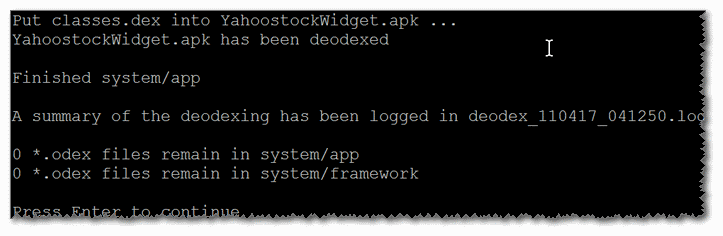

<h1>Android-Kitchen-Mod</h2>
<h2><a href="https://github.com/dsixda/Android-Kitchen/">dsixda's Android-Kitchen</a> + <em>modifications</em></h2>

<ul>
<li><a href="https://github.com/JesusFreke/smali/wiki/SmaliBaksmali2.2">New syntax</a> for <code>baksmali</code> and <code>smali</code> version 2.2+ (currently <code>2.2.2</code>)</li>
</ul>

here is the original Readme:
<pre>
Welcome to dsixda's Android Kitchen.  This is a ROM customization kitchen used for Android devices made by manufacturers such as HTC, Samsung and many others.

Downloading the kitchen:

To get the latest (as well as older) official releases from GitHub: 
https://github.com/dsixda/Android-Kitchen/releases 

To get the latest beta release from Github (newer than official, yet to be tagged as a release): 
https://github.com/dsixda/Android-Kitchen/archive/master.zip

A list of supported devices, as well as release notes, setup instructions and FAQ are all found here:
http://forum.xda-developers.com/showthread.php?p=5626292
</pre>